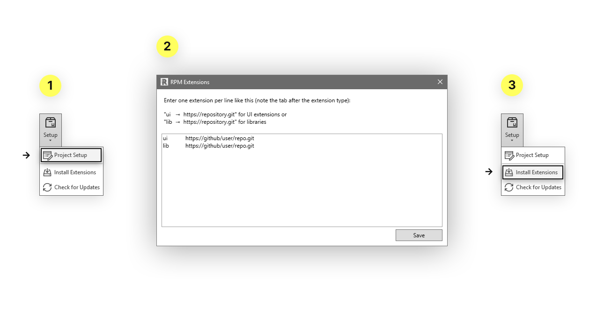

# RPM

Revitron Package Manager &mdash; a package manager for [pyRevit](https://github.com/eirannejad/pyRevit) that lets you define a list of extensions as dependencies for your Revit projects.

## Installation

Note that RPM requires [Revitron](https://revitron.readthedocs.io/) and [Git](https://git-scm.com/) for managing extension repositories. 

    pyrevit extend lib revitron https://github.com/revitron/revitron.git --dest=extensions
    pyrevit extend ui rpm https://github.com/revitron/rpm.git --dest=extensions

## Usage

By using RPM, it is possible to define dependecies &mdash; pyRevit extensions &mdash; for Revit projects. The list of required extensions gets stored with a document. Therefore it is possible to easily switch environments when working with different projects.

To only update installed extensions manually without re-installing them, the **Revitron > RPM > Setup > Check for Updates** button can be used. Note that on every start of Revit, the package manager automatically checks for updates of installed packages as well as the pyRevit repository.

---

&copy; 2020, Marc Anton Dahmen &mdash; MIT license